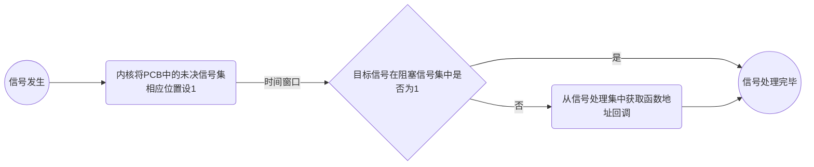
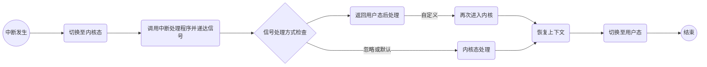

# 信号概念及产生

信号是一种**异步通知机制**，内核通过信号告知目标进程某一事件已经发生，请求进程对该信号做出处理。例如在命令行上敲下ctrl+c其实就是发送了一个终止信号给前台进程组，前台进程在收到终止信号后会被强行终止。

Unix标准提供了一组标准的信号集合，可以通过*kill -l*命令查看，每一个信号是一个宏常量，被扩展为一个整型类型。


注：==*（没有0号信号和32、33号信号）*==

## 键盘事件eg

1. CTRL+C，向==前台进程组==发送终止信号，强制结束前台进程组运行
2. CTRL+Z，向前台进程组发送挂起信号，暂停前台进程组的运行

…………

*（键盘事件的目标都是前台进程组）*

## 软件中断eg

1. 进程自身调用sleep函数
2. 进程自身调用raise函数
3. 进程自身调用abort函数

…………

## 硬件中断eg

1. 除0错误
3. 时钟中断

…………

# 信号处理方式

进程可以针对不同的信号设置不同的处理方式，分别对应**默认处理(SIG_DEF)、忽略处理(SIG_IGN)、自定义处理**；忽略处理及进程不对信号产生任何相应，默认处理对于大部分信号来说是终止进程，自定义处理即信号处理时调用用户自定义的回调函数。

==SIGKILL(9) 和 SIGSTOP(19) 信号不可被自定义==

## PCB中关于信号的数据结构

在信号产生时进程并不会立刻对信号做出相应，处于这个时间窗口的信号称之为==未决信号(挂起信号)==；

当进程对收到的信号做出处理称之为==信号递达==；

进程可以选择阻塞某些信号的递达，即==阻塞信号==，*阻塞信号不等于忽略信号，忽略信号属于信号递达方式之一*

PCB中维护了进程的三个关于信号的数据结构

1. *未决信号集*
2. *阻塞信号集*
3. *信号处理集*

其中未决信号集和阻塞信号集是内核定义的一种位图类型==(sigset_t信号集)==,而信号处理集是一个函数指针数组，绑定着各个信号的处理方式

*从逻辑结构上看如下图所示*


当信号发生时由内核在进程PCB中设置相应的信号位，进程在合适的时机对该信号做出相应。



## 信号捕捉

信号的捕捉是一个复杂流程，它发生于==内核态回变到用户态==的时刻，充斥着用户态和内核态的切换。具体过程如下

1. ***用户态下因为中断进入内核***
2. ***内核中断处理完毕后递送信号***
3. ***如果处理方式为忽略或默认则在内核态直接完成***
4. ***如果处理方式为自定义则返回用户态完成***
5. ***用户态处理完成后返回再次进入内核***
6. ***在内核态中恢复上下文后返回用户态继续执行***



==为什么对于自定义处理需要返回在用户态完成:==这一步主要为了安全，在用户态下进程收到诸多限制，可以避免执行恶意逻辑破坏内核数据

# 信号集sigset_t

由于不同的信号数量可能会超过一个整型数的位数，Unix提供的系统基本数据类型sigset_t被广泛用于信号相关的API，如果我们需要查看或设置未决信号集或阻塞信号集，往往都要通过sigset_t参数进行操作。POSIX标准定义了有关于信号集数据类型的5的API

```c
#include <signal.h>
int sigemptyset(sigset_t* set);  //将信号集所有位都置0
int sigfillset(sigset_t* set);   //将信号集所有位都置1
int sigaddset(sigset_t* set,int signo); 	 //信号集某一位(特定信号)置1
int sigdelset(sigset_t* set,int signo);      //信号集某一位置0
int sigismember(const sigset_t* set,int signo);  //判断某一位是否为1
```

==POSIX规定在使用信号集数据类型必须先调用sigemptyset或sigfillset进行初始化操作==

## sigprocmask

sigprocmask可以查改进程的阻塞信号集(信号屏蔽字),**它只适用于单线程进程**

```c
int sigprocmask(int how,const sigset_t* set,sigset_t* oset);
//oset用于返回当前信号屏蔽字
//set和how共同绝对对信号屏蔽字的处理
```

*how的取值*

- **SIG_BLOCK : set对原信号屏蔽字进行新增操作**
- **SIG_UNBLOCK :set对原信号屏蔽字进行删除操作**
- **SIG_SETMASK :set对原信号屏蔽字进行覆盖操作**

## sigpending

sigpending可以查进程的未决信号集

```c
int sigpending(sigset_t* set);
```

sigpending返回的信号集，比特位为1的信号因被阻塞而不能被传递。因此处于挂起状态。

# 信号处理程序

## signal、sigaction

Unix提供了2个接口用于设置信号处理程序，一个是具备可移植性的sigaction、一个是不具备可移植性的signal

```c
sighandler_t signal(int signum, sighandler_t handler);
int sigaction(int signum, const struct sigaction *act,struct sigaction *oldact);
```

尽管在Linux下signal和sigaction的语义是一样，但是这不能保证signal在其他Unix平台的具有相同的语义，因此如果需要绑定自定义信号处理程序请使用sigaction

>  typedef void (*sighandler_t)(int);     //sighandler_t是一个函数指针，规定了信号处理函数无返回且仅有一个int参数
>
>  struct sigaction {
>              void     (\*sa_handler)(int); //信号处理程序1
>              void     (*sa_sigaction)(int, siginfo_t *, void *); //信号处理程序2,siginfo_t是一个结构体，保存了信号处理程序的各种信息
>
>  ​	//...
>
>  };

==信号处理程序1和2只能二选一==

## 可重入函数

**可重入函数**被定义为被中断后续还能正常执行的函数，这些函数都具有一个普遍的特征——**不涉及对全局数据的修改**。与之相反的是==不可重入函数==，不可重入函数如果在执行过程中因为信号中断，而信号处理程序也调用了一次同样的函数，就可能发生未定义行为。因此不可重入函数不应该被用于信号处理程序。*(针对信号的可重入函数为*==异步信号安全函数==*,*针对线程的可重入函数为*==线程安全函数==*)

**信号处理函数应该只执行简单的操作，避免修改全局变量。**

下图是Unix环境下已知的可重入函数

# kill、raise

kill用于向一个进程或一组进程发送信号

raise用于向自身发送一个信号

```c
int raise(int signo);
int kill(pid_t pid,int signo);
```

**raise(signo)  <==> kill(getpid(),signo);**

*kill中pid不同取值具有不同意义*

