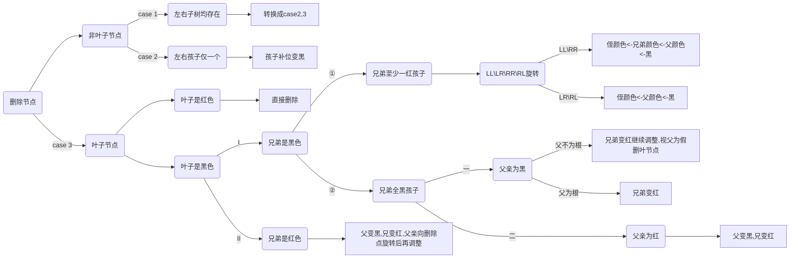

# 二叉树

## 树遍历

```cpp
struct Node{
    int val;
    Node* left=nullptr;
    Node* right=nullptr;
};
void travel(Node* root){
    if(!root) return;
    travel(root->left); /* ① */
    cout<<root->val<<' '; /* ② */
    travel(root->right); /* ③ */
    // ①②③中序-②①③先序-①③②后序
}
void levelTravel(Node* root){
    queue<Node*> q;
    q.push(root);
    while(!q.empty()){
        size_t nr=q.size();
        while(nr--){
           	Node* node=q.front();
           	q.pop();
            cout<<node->val<<' ';
            if(node->left) q.push(node->left);
            if(node->right) q.push(node->right);
        }
    }
}
void preOrder(Node* root){
    stack<Node*> st;
    do{
        while(root){
            cout<<root->val<<' ';
            st.push(root);
            root=root->left;
        }
        root=st.top()->right;
        st.pop();
    }while(!st.empty() || root);
}
void inOrder(Node* root){
    stack<Node*> st;
    do{
        while(root){
            st.push(root);
            root=root->left;
        }
        cout<<st.top()->val<<' ';
        root=st.top()->right;
        st.pop();
    }while(!st.empty() || root);
}
void postOrder(Node* root){
    /* 将先序遍历的结果倒序输出 */
}
```

## 树构建

## 堆

```c
typedef struct Heap {
	vector<int> array;
	void push(int key);
	void pop();
	int top();
}Heap;
int Heap::top() {return array.front();}
void Heap::push(int key) {
	array.push_back(key);
	int childi = array.size() - 1, parenti = (childi - 1) / 2;
	while (childi > 0){
		if (array[childi] > array[parenti]){
			swap(array[childi], array[parenti]);
			childi = parenti; parenti = (childi - 1) / 2;
		}else break;
	}
}
void Heap::pop() {
	swap(array.front(), array.back());
	array.pop_back();
	int parenti = 0, childi = parenti * 2 + 1, n = array.size();
	while (childi < n){
		if (childi + 1 < n && array[childi + 1] > array[childi]) ++childi;
		if (array[childi] > array[parenti]){
			swap(array[childi], array[parenti]);
			parenti = childi;
			childi = parenti * 2 + 1;
		}else break;
	}
}
```


### 霍夫曼树


```cpp
struct Node {
	int val;
	Node* left = nullptr;
	Node* right = nullptr;
	char name = '\0';
	Node(int _val):val(_val){}
};

struct cmp {
	bool operator()(Node* n1, Node* n2) {
		return n1->val > n2->val;
	}
};

Node* buildHuffmanTree(int cnt[26]) {
	priority_queue<Node*, vector<Node*>, cmp> heap; /* 小根堆 */
	for(int i=0;i<26;++i) 
		if (cnt[i] > 0) {
			Node* node = new Node(cnt[i]);
			node->name = 'A' + i;
			heap.push(node);
		}
	while (heap.size() > 1) {
		Node* first_min = heap.top();
		heap.pop();
		Node* second_min = heap.top();
		heap.pop();
		Node* node = new Node(first_min->val + second_min->val);
		node->left = first_min;
		node->right = second_min;
		heap.push(node);
	}
	return heap.top();
}

void convertCode(Node* root,string code="") {
	if (!root->left && !root->right) {
		printf("%c:%s\n", root->name, code.c_str());
		return;
	}
	if (root->left) convertCode(root->left, code+'0');
	if (root->right) convertCode(root->right, code+'1');
}

int calculateWSL(Node* root) {
	queue<Node*> q; /* 层序遍历辅助队列 */
	q.push(root);
	int level = 0, WSL = 0;
	while (!q.empty()) {
		size_t nr = q.size();
		while (nr--) {
			Node* node = q.front();q.pop();
			if (!node->left && !node->right ) WSL += level * node->val;
			if (node->left) q.push(node->left);
			if (node->right) q.push(node->right);
		}
		++level;
	}
	return WSL;
}
```

==**霍夫曼编码和带权路径长度不是唯一的**==

## 搜索树


```cpp
struct Node {
	int val;
	Node* left = nullptr;
	Node* right = nullptr;

	Node(int val): val(val)	{}
};

typedef struct BSTree {
	Node* root = nullptr;

	void insert(int key);
	void erase(int key);
}BST;

void BSTree::insert(int key) {
	if (!root) root = new Node(key);	/* 空树插入仅需要修改root */
	else {		/* 非空树插入找到一个空节点进行赋值 */
		Node* prev = nullptr, * cur = root;
		while (cur) {
			prev = cur;
			cur = key > cur->val ? cur->right : cur->left;
		}	/* cur新节点的位置，prev是其父节点 */
		cur = new Node(key);
		prev->val > key ? prev->left = cur : prev->right = cur;
	}
}

void BSTree::erase(int key) {
	Node *cur = root,*before=nullptr; /* cur为待删除节点,before是其父节点 */
	while (cur) {
		if (cur->val > key) { before = cur, cur = cur->left; }
		else if (cur->val < key) { before = cur, cur = cur->right; }
		else break;
	}	/* 找到cur节点 */
	if (cur) {
		if (!cur->left && !cur->right) {	/* 删除叶节点 (case 1) */
			if (before) { cur == before->left ? before->left = nullptr : before->right = nullptr; }
			else root = nullptr;	/* before==NULL表示要删除根节点 (case 1-special) */ 
			delete cur;
		}else {	/* 删除非叶节点 */
			Node *target = nullptr,*prev=cur;  /* target为交换节点，prev是其父节点 */
			if (cur->left) {	/* 存在左子树 (case2 and case4) */
				target = cur->left;
				while (target->right) {	prev = target, target = target->right;}
				prev!=cur ? prev->right = target->left : cur->left = target->left; /* special */
			}else {				/* 存在右子树 (case3) */
				target = cur->right;
				while (target->left) { prev = target, target = target->left; }
				prev!=cur ? prev->left = target->right : cur->right = target->right; /* special */
			}
			swap(cur->val, target->val);
			delete target;
		}
	}
}
```

### AVL树


```cpp
struct TreeNode {
	int val;
	int avl = 0;
	TreeNode* left = nullptr;
	TreeNode* right = nullptr;
	TreeNode* prev = nullptr;

	TreeNode(int _val):val(_val){ }
};

struct AVLTree {
	TreeNode* root = nullptr;
	void insert(int key);
	void erase(int key);
};

void AVLTree::insert(int key) {
	/* step1 : 定位新增节点位置 */
	TreeNode* node = root,*before=nullptr;
	while (node) {
		before = node;
		node = key > node->val ? node->right : node->left;
	}
	node = new TreeNode(key);
	if (!before) {
		root = node;
		return;
	}else {
		node->prev = before;
		before->val < key ? before->right = node : before->left = node;
	}

	/* step2 : 向上更新平衡因子 */
	TreeNode* cur = node;
	TreeNode* parent = nullptr;
	while (cur) {
		parent = cur->prev;
		if (parent) {
			parent->left == cur ? ++parent->avl : --parent->avl;
			if (abs(parent->avl) > 1) break;
		}
		cur = parent;
	}

	/* step3 : 旋转调整 */
	if (cur) {
		/* case1 : LL */
		if (parent->avl == 2 && cur->avl == 1) {
			parent->avl = cur->avl = 0;

			if (parent != root) parent->prev->left == parent ? parent->prev->left = cur : parent->prev->right = cur; //Don't forget!

			TreeNode* temp = cur->right;
			cur->right = parent;
			cur->prev = parent->prev;
			parent->prev = cur;
			parent->left = temp;
			if(temp) temp->prev = parent;	//Don't forget

			if (parent == root) root = cur;
		}

		/* case2 : RR */
		if (parent->avl == -2 && cur->avl == -1) {
			parent->avl = cur->avl = 0;

			if(parent!=root) parent->prev->left == parent ? parent->prev->left = cur : parent->prev->right = cur;

			TreeNode* temp = cur->left;
			cur->left = parent;
			cur->prev = parent->prev;
			parent->prev = cur;
			parent->right = temp;
			if(temp) temp->prev = parent;

			if (parent == root) root = cur;
		}

		/* case3 : LR */
		if (parent->avl == 2 && cur->avl == -1) {
			TreeNode* child = cur->right;
			if (child->avl == 0 ) cur->avl = parent->avl = 0;
			else if(child->avl==-1) {
				cur->avl = 0; parent->avl = -1;
			}else{
				cur->avl = 1; parent->avl = 0;
			}
			child->avl = 0;

			if (parent != root) parent->prev->left == parent ? parent->prev->left = child : parent->prev->right = child;

			cur->right = child->left;
			parent->left = child->right;
			child->left = cur;
			child->right = parent;
			child->prev = parent->prev;
			cur->prev = parent->prev = child;

			if (parent == root) root = child;
		}

		/* case4 : RL */
		if (parent->avl == -2 && cur->avl == 1) {
			TreeNode* child = cur->left;
			if(child->avl==0) cur->avl = parent->avl = 0;
			else if (child->avl == -1) {
				cur->avl = 0; parent->avl = 1;
			}else {
				cur->avl = -1; parent->avl = 0;
			}
			child->avl = 0;

			if (parent != root) parent->prev->left == parent ? parent->prev->left = child : parent->prev->right = child;

			cur->left = child->right;
			parent->right = child->left;
			child->left = parent;
			child->right = cur;
			child->prev = parent->prev;
			cur->prev = parent->prev = child;
		
			if (parent == root) root = child;
		}
	}
}

void AVLTree::erase(int key) {
	/*删除调整与新增同理*/
    /*
    	唯一的不同点在于删除需要迭代向上调整
    	新增只需要调整最近一个失衡点
    */
    //...
}
```

### 红黑树

**新增**


**删除**




> *(删除的叶子为红色节点没有图示)*


```cpp
enum Color {
    RED,
    BLACK
};
#define ISBLACK(node) !node || node->color==BLACK
#define ISRED(node) !(ISBLACK(node))
#define TURNRED(node) node->color=RED
#define TURNBLACK(node) node->color=BLACK

struct TreeNode {
    int val;
    Color color = RED;
    TreeNode* left = nullptr;
    TreeNode* right = nullptr;
    TreeNode* prev = nullptr;

    TreeNode(int _val):val(_val){}
};

struct RBTree {
    TreeNode* root = nullptr;

    void insert(int key);
    void erase(int key);
};

void RBTree::insert(int key) {
    /* case 1 : 插入根节点 */
    if (!root) {
        root = new TreeNode(key);
        root->color = BLACK;	
        return;
    }

    TreeNode* cur = root,*father=nullptr;
    while (cur) {
        father = cur;
        cur = key > cur->val ? cur->right : cur->left;
    }
    cur = new TreeNode(key);
    cur->prev = father;
    key > father->val ? father->right = cur : father->left = cur;

    if (ISBLACK(father)) return;	/* 不违反不红红则无需调整 */

    TreeNode* grand = father->prev;
    if (!grand) return;
    TreeNode* uncle = grand->left == father ? grand->right : grand->left;
    TreeNode* sibling = nullptr, *nephew = nullptr;

Adjust:
    if (ISRED(uncle)) {		/* case 2 : 插入非根节点且叔节点为红 */
        TURNBLACK(uncle);
        TURNBLACK(father);
        TURNRED(grand);

        cur = grand;
        father = cur->prev;
        if (father) {
            grand = father->prev;
            if (grand) {
                uncle = father == grand->left ? grand->right : grand->left;
                goto Adjust;
            }
        }
    }else {					/* case 3 : 插入非根节点且叔节点为黑 */
        if (grand->left == father && father->left == cur) {   // LL
            TURNBLACK(father);
            TURNRED(grand);
            if (grand == root) root = father;

            sibling = father->right;
            if (sibling) sibling->prev = grand;

            father->right = grand;
            father->prev = grand->prev;

            grand->left = sibling;
            if (grand->prev) grand->prev->right == grand ? grand->prev->right = father : grand->prev->left = father;
            grand->prev = father;
        }
        if (grand->right == father && father->right == cur) { // RR
            TURNBLACK(father);
            TURNRED(grand);
            if (grand == root) root = father;

            sibling = father->left;
            if (sibling) sibling->prev = grand;

            father->left = grand;
            father->prev = grand->prev;

            grand->right = sibling;
            if (grand->prev) grand->prev->right == grand ? grand->prev->right = father : grand->prev->left = father; //Don't forget
            grand->prev = father;
        }
        if (grand->left == father && father->right == cur) {  // LR
            TURNRED(grand);
            TURNBLACK(cur);
            if (grand == root) root = cur;

            father->right = cur->left;
            father->prev = cur;

            grand->left = cur->right;
            if (grand->prev) grand->prev->right == grand ? grand->prev->right = cur : grand->prev->left = cur;
            cur->prev = grand->prev;
            grand->prev = cur;

            if (cur->left) cur->left->prev = father;
            if (cur->right) cur->right->prev = grand;

            cur->left = father;
            cur->right = grand;
        }
        if (grand->right == father && father->left == cur) {  // RL
            TURNRED(grand);
            TURNBLACK(cur);
            if (grand == root) root = cur;

            father->left = cur->right;
            father->prev = cur;

            grand->right = cur->left;
            if (grand->prev) grand->prev->right == grand ? grand->prev->right = cur : grand->prev->left = cur;
            cur->prev = grand->prev;
            grand->prev = cur;

            if (cur->left) cur->left->prev = grand;
            if (cur->right) cur->right->prev = father;

            cur->right = father;
            cur->left = grand;
        }
    }

    root->color = BLACK; /* 根叶黑 */
}

void RBTree::erase(int key) {
    TreeNode* cur = root;
    while (cur) {
        if (key > cur->val) cur = cur->right;
        else if (key < cur->val) cur = cur->left;
        else break;
    }
    if (cur) {
        bool del = true;
Adjust1:
        if (cur->left && cur->right) { /* case 1 : 左右子树均有 */
            TreeNode* temp = cur->right;
            while (temp->left) temp = temp->left;
            swap(cur->val, temp->val);
            cur = temp;
            goto Adjust1;
        }
        if (!(cur->left && cur->right) && (cur->left || cur->right)) { /* case 2 : 只有左孩子or右孩子 */
            TreeNode* father = cur->prev;
            if (cur->left) {
                cur->left->prev = father;
                if (father) father->left == cur ? father->left = cur->left : father->right = cur->left;	//special : 2个节点树删根father==null
                else root = cur->left;
                TURNBLACK(cur->left);
            }else {
                cur->right->prev = father;
                if (father) father->left == cur ? father->left = cur->right : father->right = cur->right;	
                else root = cur->right;
                TURNBLACK(cur->right);
            }
        }
        if (!cur->left && !cur->right) {	/* case 3 删除叶子节点 */
Adjust2:
            TreeNode* father = cur->prev;
            if (!father) {
                delete root;
                root = nullptr;
                return;
            }
            TreeNode* sibling = nullptr;
            if (!father->left) sibling = father->right;
            else if (!father->right) sibling = father->left;
            else sibling = father->left == cur ? father->right : father->left;
            if (ISBLACK(sibling)) {	/* I */
                if (ISRED(sibling->left) || ISRED(sibling->right)) {	/* ① */
                    if (cur == father->right) {
                        if (sibling->left) { //LL
                            TreeNode* nephew = sibling->left;
                            nephew->color = sibling->color;
                            sibling->color = father->color;
                            TURNBLACK(father);

                            TreeNode* grand = father->prev;
                            father->left = sibling->right;
                            if(del) father->right = nullptr;
                            father->prev = sibling;

                            if (sibling->right) sibling->right->prev = father;
                            sibling->right = father;
                            sibling->prev = grand;

                            if (grand) grand->left == father ? grand->left = sibling : grand->right = sibling;
                            else root = sibling;
                        }
                        else {	//LR
                            TreeNode* nephew = sibling->right;
                            nephew->color = father->color;
                            TURNBLACK(father);

                            TreeNode* grand = father->prev;
                            sibling->prev = nephew;
                            sibling->right = nephew->left;

                            father->prev = nephew;
                            father->left = nephew->right;
                            if(del) father->right = nullptr;

                            nephew->prev = grand;
                            nephew->left = sibling;
                            nephew->right = father;

                            if (grand) grand->left == father ? grand->left = nephew : grand->right = nephew;
                            else root = nephew;
                        }
                    }else {	/* ② */
                        if (sibling->right) { //RR
                            TreeNode* nephew = sibling->right;
                            nephew->color = sibling->color;
                            sibling->color = father->color;
                            TURNBLACK(father);

                            TreeNode* grand = father->prev;
                            father->right = sibling->left;
                            if(del) father->left = nullptr;
                            father->prev = sibling;

                            if (sibling->left) sibling->left->prev = father;
                            sibling->left = father;
                            sibling->prev = grand;

                            if (grand) grand->left == father ? grand->left = sibling : grand->right = sibling;
                            else root = sibling;
                        }else {	//RL
                            TreeNode* nephew = sibling->left;
                            nephew->color = father->color;
                            TURNBLACK(father);

                            TreeNode* grand = father->prev;
                            sibling->prev = nephew;
                            sibling->left = nephew->right;

                            father->prev = nephew;
                            father->right = nephew->left;
                            if(del) father->left = nullptr;

                            nephew->prev = grand;
                            nephew->right = sibling;
                            nephew->left = father;

                            if (grand) grand->left == father ? grand->left = nephew : grand->right = nephew;
                            else root = nephew;
                        }
                    }
                }else{ /* ② */
                    if (ISBLACK(father)) { /* (1) */
                        TURNRED(sibling);
                        if (father != root) {
                            father->left == cur ? father->left = nullptr : father->right = nullptr;
                            delete cur;
                            cur = father;
                            del = false; //假删
                            goto Adjust2;
                        }
                        if(del) father->left == cur ? father->left = nullptr : father->right = nullptr;
                    }else{ /* (2) */
                        TURNBLACK(father);
                        TURNRED(sibling);
                        if (del) father->left == cur ? father->left = nullptr : father->right = nullptr;
                    }
                }
            }else{ /* II */
                TURNRED(father);
                TURNBLACK(sibling);
                TreeNode* grand = father->prev;

                if (cur == father->right) {
                    father->prev = sibling;
                    father->left = sibling->right;
                    if (del) father->right = nullptr;

                    if(sibling->right) sibling->right->prev = father;
                    sibling->prev = grand;
                    sibling->right = father;
                }else{
                    father->prev = sibling;
                    father->right = sibling->left;
                    if(del) father->left = nullptr;

                    if (sibling->left) sibling->left->prev = father;
                    sibling->prev = grand;
                    sibling->left = father;
                }

                if (grand) grand->left == father ? grand->left = sibling : grand->right = sibling;
                else root = sibling;

                goto Adjust1;
            }
        }
        if(del) delete cur;
    }
}
```


# B树

## B+树

## B*树

# 基数树